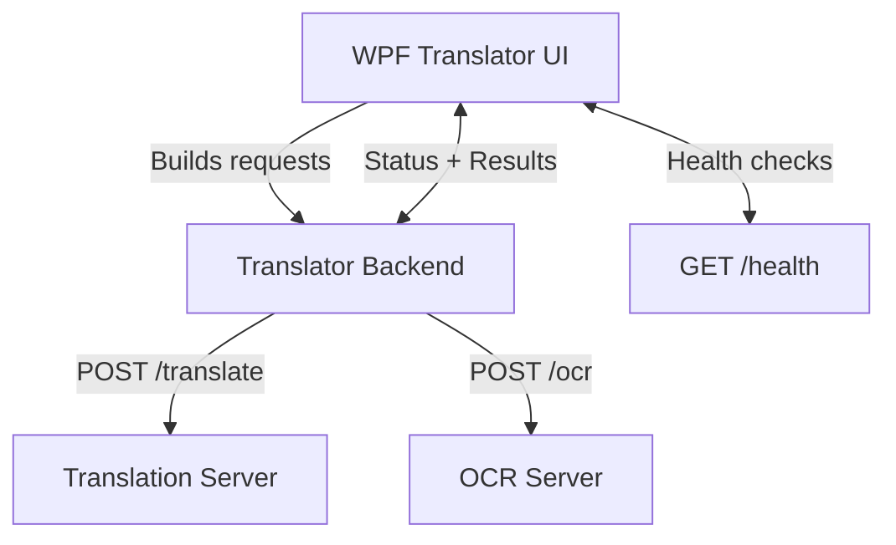
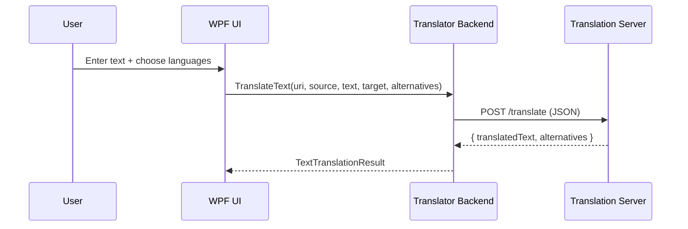
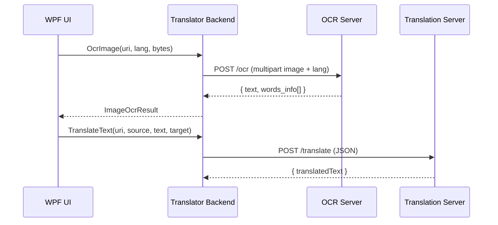

# Language OCR and Translator

## Project overview
Language OCR and Translator is a Windows/WPF desktop application that combines OCR extraction and machine translation. The UI is a multi-tab workspace that lets users translate plain text, images, and PDFs while sharing common language selection, server connectivity status, and error reporting. The core translation and OCR calls are delegated to a backend library that wraps HTTP calls to the configured services.

## Key capabilities
- **Text translation** with support for alternative translations.
- **Image OCR + translation** by extracting words/regions and grouping them for rendering and translation.
- **PDF translation** by applying the same OCR/translation pipeline across document pages.
- **Server health monitoring** to show OCR/translation connectivity in the UI.
- **Configurable endpoints** for OCR and translation servers, including separate IP/port settings.

## Architecture
The solution is split into a WPF client and a backend library:

- **Translator (WPF app)**
  - Orchestrates UI workflows and manages state like language selection, server status, and errors.
  - Builds OCR/translation requests using the backend and the configured endpoints.
- **Translator Backend (library)**
  - Provides `TranslateText` and `OcrImage` APIs (sync/async) that encapsulate HTTP requests.
  - Parses JSON payloads into typed results for translation and OCR.



## Data flow by feature

### Text translation
1. User enters text and picks source/target languages.
2. The UI builds a `/translate` URL based on the configured translation server.
3. The backend sends a JSON POST request and parses the translated text and alternatives.



### Image/PDF OCR + translation
1. User selects an image (or PDF page rendered to an image).
2. The UI builds a `/ocr` URL based on the configured OCR server.
3. The backend sends the image as multipart form data plus the language code.
4. The OCR response returns word bounding boxes used to group text and drive overlays.
5. Extracted text is then translated using the same `/translate` call.



## API calls

### Translation request
The translation handler sends JSON to the configured translation server. The URI is supplied by the UI and typically points at the `/translate` route.

**Request**
```http
POST http://<translation-host>:<port>/translate
Content-Type: application/json

{
  "q": "Hello world",
  "format": "text",
  "source": "en",
  "target": "es",
  "alternatives": 2,
  "api_key": ""
}
```

**Response (expected shape)**
```json
{
  "translatedText": "Hola mundo",
  "alternatives": ["Hola mundo", "Buenas mundo"]
}
```

### OCR request
The OCR handler sends multipart form data with an image and language code. The URI is supplied by the UI and typically points at the `/ocr` route.

**Request**
```http
POST http://<ocr-host>:<port>/ocr
Content-Type: multipart/form-data

--boundary
Content-Disposition: form-data; name="image"; filename="uploaded_image.jpg"
Content-Type: image/jpeg

<binary image bytes>
--boundary
Content-Disposition: form-data; name="lang"

en
--boundary--
```

**Response (expected shape)**
```json
{
  "text": "Hello world",
  "words_info": [
    {
      "word": "Hello",
      "confidence": 98,
      "bounding_box": { "x1": 10, "y1": 12, "x2": 50, "y2": 28 }
    }
  ]
}
```

### Health checks
The UI polls both services for `/health` to determine if OCR and translation servers are online.

```http
GET http://<ocr-host>:<port>/health
GET http://<translation-host>:<port>/health
```

## Result mapping
- OCR results map to text plus word-level metadata (bounding boxes + confidence), which the UI groups for rendering.
- Translation results map to a translated string plus optional alternatives.

## Repository structure
- `src/Translator` — WPF desktop client.
- `src/Translator Backend` — Backend library that handles HTTP calls + JSON parsing.
- `src/Translator Installer` — Installer project.
- `libs` — Supporting libraries.

## Configuration notes
- Server IP/port settings are controlled by the UI configuration and used to build `/ocr` and `/translate` URLs.
- The backend expects services that conform to the request/response shapes described above.
