<p align="center">
  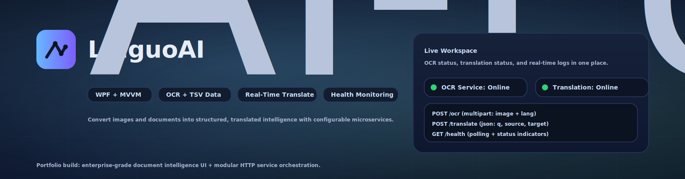
</p>
<p align="center">

  
  
  
  
  


</p>

---

## 🔥 Overview

**LinguoAI** is a high-performance Windows desktop application built using **WPF + MVVM architecture** that transforms images and documents into structured, translated intelligence.

It integrates:

- 🖼 High-accuracy OCR extraction  
- 📊 Word-level bounding box metadata  
- 📄 TSV structured parsing  
- 🌎 Real-time translation  
- ⚡ Server health monitoring  
- ⚙ Configurable AI microservice endpoints  

Designed for **enterprise-grade document intelligence workflows**.

---
## ✨ Core Modules

###  OCR Engine
Extracts text with bounding box metadata and confidence scoring.

### 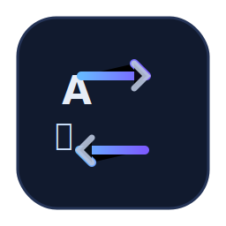 Translation Engine
Handles REST translation with dynamic source/target language support.

### 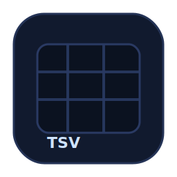 TSV Parser
Transforms OCR output into structured record collections.

###  Health Monitor
Tracks service availability in real time via /health polling.

###  Configuration
Supports runtime endpoint switching and environment isolation.

---
## 🎥 Demo Preview

<p align="center">
  
</p>

> End-to-end OCR → Structured TSV → Real-Time Translation pipeline in action.

---

# ✨ Core Capabilities

| Category | Capability |
|-----------|------------|
| OCR | Word-level bounding boxes + confidence scoring |
| Parsing | TSV structured metadata extraction |
| Translation | REST-based real-time translation engine |
| Monitoring | Live service health polling |
| Configuration | Dynamic IP/Port endpoint switching |
| Logging | Real-time diagnostic feed |
| Extensibility | Modular AI service abstraction |

---
# 🏗 System Architecture
## Architecture (Animated)

<p align="center">
  <a href="docs/diagrams/architecture-animated.svg">
    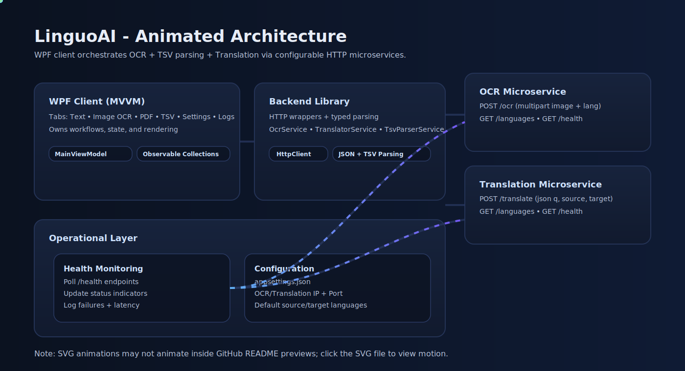
  </a>
</p>

## Architecture Diagrams

### System Architecture
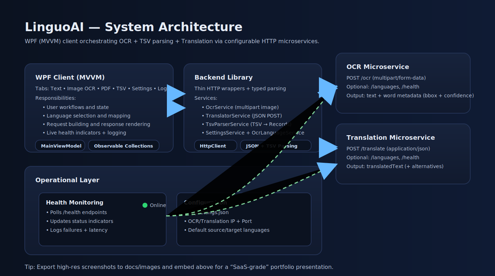

### OCR → TSV → Translation Pipeline


### Deployment & Connectivity Model
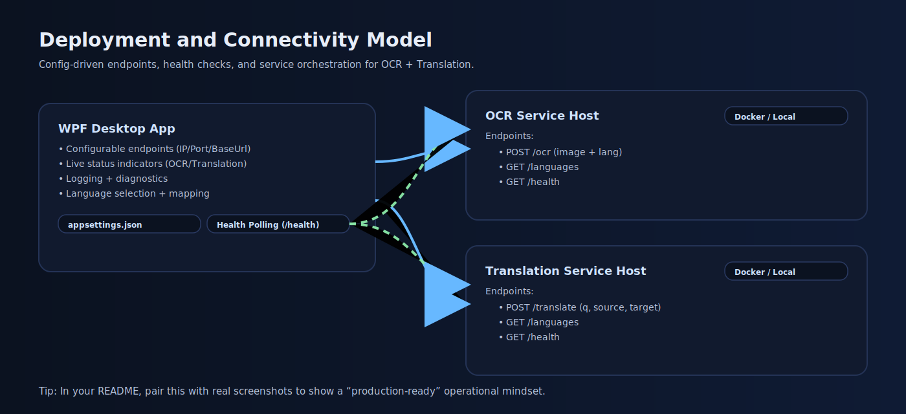


## High-Level Flow

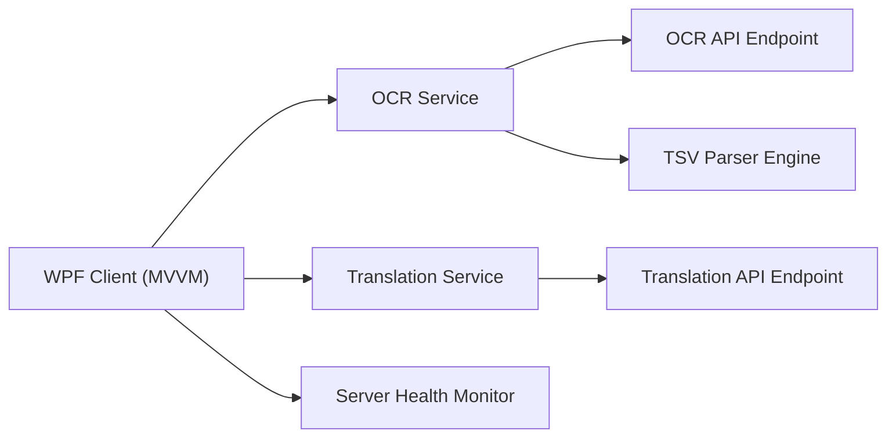

---

## Document Processing Pipeline

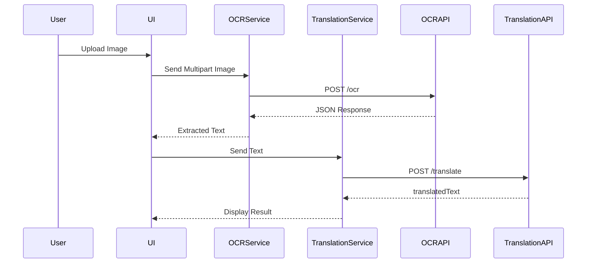

---

# 📡 API Specifications

## 🔹 Translation Endpoint

```
POST /translate
Content-Type: application/json
```

### Request

```json
{
  "q": "Hello world",
  "source": "en",
  "target": "es"
}
```

### Response

```json
{
  "translatedText": "Hola mundo"
}
```

---

## 🔹 OCR Endpoint

```
POST /ocr
Content-Type: multipart/form-data
```

### Response

```json
{
  "text": "Hello world",
  "words_info": [
    {
      "word": "Hello",
      "confidence": 98,
      "bounding_box": {
        "x1": 10,
        "y1": 12,
        "x2": 50,
        "y2": 28
      }
    }
  ]
}
```

---

# 📊 OCR Metadata Model

| Property | Description |
|-----------|------------|
| Level | Hierarchical grouping level |
| PageNum | Page index |
| BlockNum | Block identifier |
| LineNum | Line grouping |
| WordNum | Word index |
| Left/Top | Bounding box position |
| Width/Height | Bounding box size |
| Conf | Confidence score |
| Text | Extracted word |

---

# 🖥 Product Screens

## Dashboard

<p align="center">
  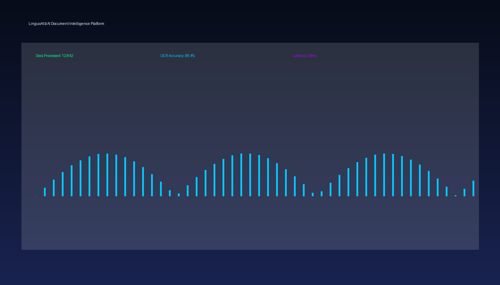
</p>

---

## OCR with Bounding Boxes

<p align="center">
  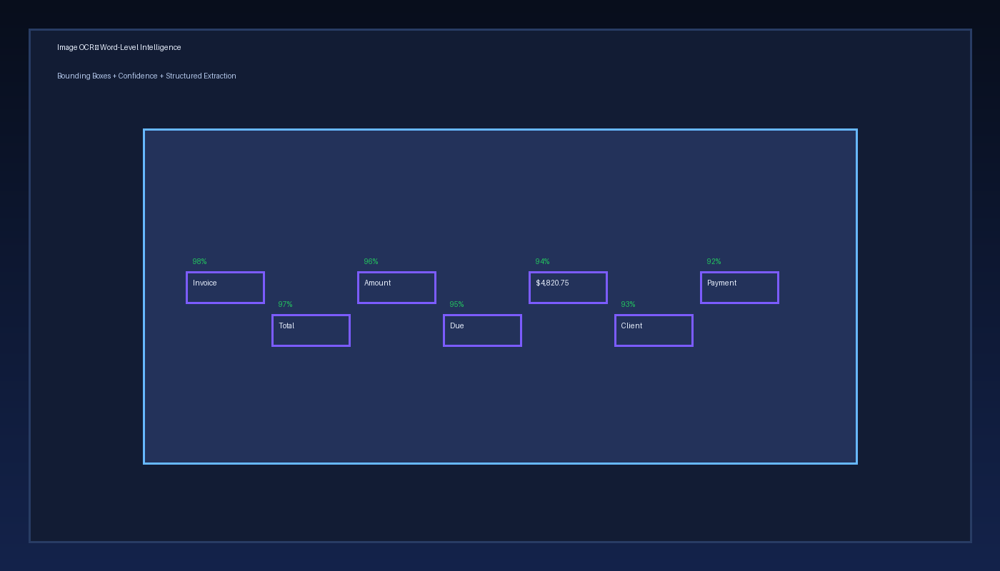
</p>

---

## TSV Structured Analytics View

<p align="center">
  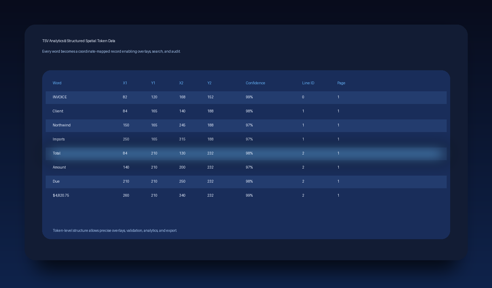
</p>

---

## Translation Workspace

<p align="center">
  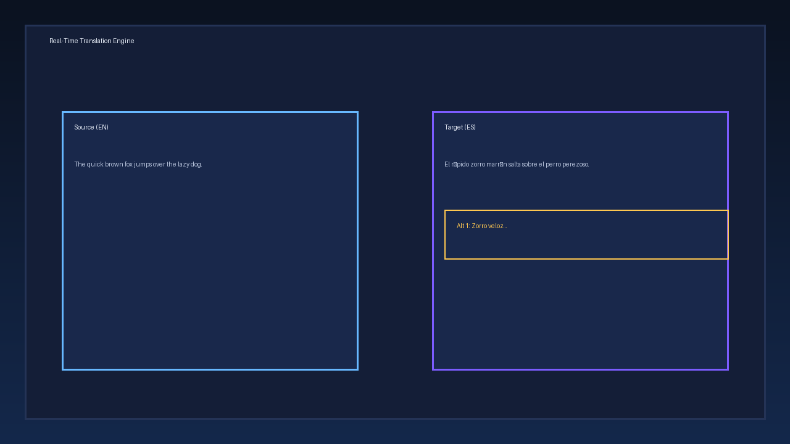
</p>

---

# 🛠 Technical Stack

| Layer | Technology |
|-------|------------|
| UI | WPF (.NET 8) |
| Pattern | MVVM |
| Networking | HttpClient (async) |
| Data Binding | ObservableCollection |
| Parsing | JSON + TSV |
| Config | JSON-based settings |
| Monitoring | Periodic health polling |

---

# 📦 Project Structure

```
src/
 ├── Translator (WPF UI)
 ├── Translator Backend
 ├── Installer
docs/
 ├── images/
 ├── demo/
```

---

# 🚀 Enterprise Benefits

| Benefit | Value |
|----------|-------|
| Modular Architecture | Swap OCR/translation engines easily |
| Offline Capable | Suitable for secure environments |
| Structured Output | Enables downstream analytics |
| Real-Time Monitoring | Operational reliability |
| Clean Separation | Scalable service abstraction |

---

# 📈 Performance Characteristics

- Async non-blocking API calls  
- UI-thread safe dispatcher updates  
- Efficient bitmap streaming  
- Structured data parsing  
- Real-time observable updates  

---

# 🔐 Security Considerations

- No hardcoded secrets  
- Endpoint configurability  
- Controlled HTTP request handling  
- Defensive exception management  
- Config-based environment separation  

---

# 📌 Requirements

## Development

- .NET SDK 8+
- Visual Studio / Rider
- Windows OS

## Runtime

- OCR API service running
- Translation API service running
- Configured endpoints in `appsettings.json`

---

# 🎯 Engineering Highlights

- Clean MVVM architecture  
- Dependency injection pattern  
- Async command implementation  
- Service abstraction layer  
- Language mapping logic  
- Structured error logging  
- Health monitoring service  

---

# 💼 Use Cases

- Government document processing  
- Legal translation workflows  
- Healthcare documentation  
- Multilingual research analysis  
- Offline secure deployments  

---

# 🧠 Built By

**Brian Hannigan**  
Software Engineer | AI Systems Architect  
14+ years in secure government systems  
Specializing in AI-powered document intelligence platforms  

---

# ⭐ Why This Project Matters

LinguoAI demonstrates:

- AI system orchestration  
- Microservice integration  
- Clean UI architecture  
- Real-world document intelligence workflows  
- Production-ready engineering patterns  

---

# 📬 Connect

- GitHub
- LinkedIn
- Portfolio

---

